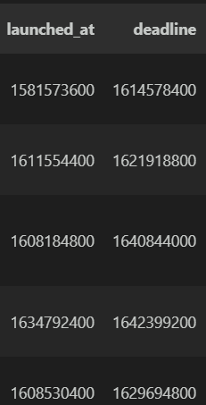

# Extract Transform Load (ETL)

## Table of Contents
1. [Introduction](#introduction)
2. [Pipeline Architecture](#eTL-pipeline-architecture)
3. [Tools Used](#tools-used)
4. [Libraries Used](#libraries-used)
5. [Process Overview](#process-overview)
6. [Function Overview](#process-overview)
7. [Step-by-Step Guide](#step-by-step-guide)
   - [Setting Up Environment](#setting-up-environment)
   - [Installing Requirements](#installing-requirements)
   - [Executing the Script](#executing-the-script)
8. [Data Schema](#data-schema)
9. [Work Flow](#work-flow)
10. [Future Enhancement](#future-enhancement)
11. [Conclusion](#conclusion)

## Introduction
ETL, or Extract, Transform, Load, is a crucial process in data management that involves gathering data from various sources such as data warehouses and data lakes in its raw format i.e., extraction. Then, this data undergoes cleaning and transformation to derive valuable and actionable insights i.e., transformation. And finally, the processed data is stored in databases for future utilization which stands for load. This script is designed to facilitate the extraction, cleaning, transformation, and loading (ETL) of crowdfunding data stored in Amazon Redshift. It connects to the Redshift cluster, executes SQL queries to extract data from CSV files stored in an S3 bucket, performs data cleaning and transformation operations, and finally loads the transformed data back into Amazon S3 and then to Amazon Athena.

In this particular ETL task, a sample of crowdfunding dataset is used.

## Pipeline Architecture


The architecture follows a typical Extract, Transform, Load (ETL) pattern, where data is extracted from a source stored it to s3 and then to redshift for efficient and easy processing , transformed to meet specific requirements, and then loaded into s3 for the availability and then to athena for easy retrival and quering.AWS services like S3, Redshift, and Athena are leveraged for their scalability, reliability, and ease of use, allowing for a robust and efficient data processing pipeline.

## Tools Used
- **Programming Language**: Python
- **Database used**: AWS Redshift, AWS S3 Bucket, AWS athena

## Libraries Used
- **boto3**: python SDK for AWS, used for interacting with Amazon S3
- **pandas**: python library for data manipulation and analysis
- **awswrangler**: utility library for Amazon Redshift
- **BytesIO**: library to work with in-memory binary data streams


## Process Overview
**1. Setting Up Environment**:
Create a virtual environment to manage  dependencies.

**2. Installing Requirements**:
Install necessary Python packages using a requirements file.

**3. Executing the Script**:
Run the Python script to extract, transform, and load the data.

## Function Overview
**1. Data Extraction Functions**
- execute_sql_in_redshift(sql_query): Executes a SQL query in the Amazon Redshift cluster.

- load_data_from_s3_to_redshift(table_name, s3_location): Copies data from a CSV file in S3 to a Redshift table and reads the data into a pandas DataFrame.

 **2. Data Cleaning and Transforming Functions**
- convert_currencies_to_usd(amount, currency): Converts an amount from a specified currency to USD using fixed exchange rates.

- split_df_by_start_year(df): Splits the DataFrame based on the start year.

- split_dfs_by_outcome(yearly_dfs): Splits the DataFrames based on the 'outcome' column.

- perform_data_transformations(crowdfunding_df): Performs data transformations on the crowdfunding DataFrame.

- merge_contact_info(crowdfunding_df, contact_df): Merges contact information with the crowdfunding DataFrame.

**3. Data Load Functions**
- store_dfs_in_s3(outcome_dfs, bucket_name): Stores the DataFrames in the outcome_dfs dictionary as CSV files and uploads them to Amazon S3.

- store_data_athena_tables(s3_location) : import files from the s3 bucket and create and stores them in athena tables

**4. Main Function**
- main(): The main function orchestrating the entire ETL process.


## Step-by-Step Guide
**1. Setting Up Environment**
- Create a virtual environment using the following command:
  ```
    python-m venv venv
  ```

**2. Installing Requirements**
- Activate the virtual environment:
    - On Windows:
      ```
        venv\Scripts\activate
      ```

    - On macOS and Linux:
      ```
        source venv/bin/activate
      ```

- Install the required packages using the provided requirements file :
  ```
    pip install -r requirements.txt
  ```

**3. Executing the Script**
- Run the Python script main.py to perform ETL of data:
  ```python
    python main.py
  ```

- For more infromation and help, use the -h or --help option
  ```python
    python main.py -h
  ```

## Data Schema
In this task two datasets are being used, crowdfunding.xlsx and contacts.csv.

**1. Description of crowdfunding.csv**

|Field                     | Dtype  | Description                                                       |
|--------------------------|--------|-------------------------------------------------------------------|
| cf_id                    | int64  | Unique identifier for Crowdfunding project                        |
| contact_id               | int64  | Unique identifier for the contact                                 |
| company_name             | object | Name of the company or project                                    |
| blurb                    | object | Brief description or pitch                                        |
| goal                     | int64  | Funding goal amount                                               |
| pledged                  | int64  | Amount pledged                                                    |
| outcome                  | object | Outcome of the crowdfunding campaign (e.g., successful, failed)   |
| backers_count            | int64  | Number of investors to contibute the goal amount                  |
| country                  | object | Country of origin                                                 |
| currency                 | object | Currency used for the funding goal and pledged amount             |
| launched_at              | int64  | Timestamp when the campaign was launched                          |
| deadline                 | int64  | Timestamp of the campaign deadline                                |
| staff_pick               | bool   | Indicates if the project was staff-picked                         |
| spotlight                | bool   | Indicates if the project was highlighted                          |
| category & sub-category  | object | Category and sub-category of the project                          |

- **cf_id** (int64): Crowdfunding ID, a unique identifier assigned to each project within the dataset.
- **contact_id** (int64): a unique identifier assigned to each associated contact.
- **company_name** (object): Name of the company or project initiating the crowdfunding campaign.
- **blurb** (object): Brief description or pitch of the crowdfunding project provided by the company or project owner.
- **goal** (int64): Funding goal amount, representing the target monetary amount intended to be raised through the crowdfunding campaign.
- **pledged** (int64): Amount pledged, indicating the total monetary contributions made by backers towards the crowdfunding campaign.
- **outcome** (object): Outcome of the crowdfunding campaign, which can be categorized as successful, failed.
- **backers_count** (int64): Number of backers who supported the crowdfunding project by making monetary contributions.
- **country** (object): Country of origin for the crowdfunding project, representing the geographical location where the project was initiated.
- **currency** (object): Currency used for the funding goal and pledged amount in the crowdfunding campaign.
- **launched_at** (int64): Timestamp indicating the date and time when the crowdfunding campaign was launched. The timestamp is in Unix epoch time format, which represents the number of seconds that have elapsed since January 1, 1970 (UTC).
- **deadline** (int64): Timestamp indicating the date and time by which the crowdfunding campaign must reach its funding goal.The timestamp is in Unix epoch time format, which represents the number of seconds that have elapsed since January 1, 1970 (UTC).
- **staff_pick** (bool): Binary indicator representing whether the project was staff-picked, i.e., highlighted or recommended by platform staff.
- **spotlight** (bool): Binary indicator representing whether the project was featured or highlighted in the platform's spotlight or special promotions.
- **category & sub-category** (object): Category and sub-category of the crowdfunding project, providing insights into the nature or industry of the project.

**2. Description of contacts.csv**

| Field       | Dtype  | Description                                            |
|-------------|--------|--------------------------------------------------------|
| contact_id  | int64  | Unique identifier for the contact                      |
| first_name  | object | First name of the company's/project's owner            |
| last_name   | object | Last name of the company's/project's owner             |
| email       | object | Email address of the company's/project's owner         |

- **contact_id** (int64):a unique identifier for each contact associated with the company or project, serves as a primary key for identifying individual contacts in the dataset.
- **first_name** (object):the first name of the company's or project's owner, provides personal identification information about the individual associated with the contact.
- **last_name** (object): the last name of the company's or project's owner, provides additional personal identification information about the individual associated with the contact
- **email**(object):the email address of the company's or project's owner, serves as a means of communication and contact information for reaching out to the individual associated with the contact.

## Work Flow
**1.Data Loading**
Initially, the data is loaded from the S3 bucket into the Redshift tables.This is carried out to enhance the efficiency of data retrieval, as Redshift demonstrates high performance when querying large datasets.


 SQL queries are used to create respective table as per each files and to copy the data from the csv files in s3 to redshift. Tables in the redshift are then read in dataframes for further mainupulations and analysis.
 

 


**2. Data Cleaning And Transformation**
After examining the data for further transformation and manipulation, the following insights about the dataset were gathered.

- None of the columns of both files contained null values


- Handling contact information in a separate CSV file was seen as a bit of a hassle for smooth operations.

- Values of the fields "launched_at" and "deadline" were in in Unix epoch time, which required to be converted to human-readable date and time format



- the "goal" and "pledged" fields contained amounts in different currencies, standardization was required


- the combination of "category" and "subcategory" in a single column was a readability challenges


All these above mentioned  issues were addressed taking following measures.
- the first_name, the last_name, and the email information of each crowdfunding pitch were merged to the crowdfunding_df using contact_is as the key to merge

- the Unix epoch time format was converted into converted to human-readable date and time format i.e "datetime" format.


- with the help of row's currency column as the lead, all the amount in the goal and the pledge columns were converted to USD as a part of standarization


- category and the sub category were splited into different columns to enchance readability


- finally all the unrequired fields 'cf_id', 'contact_id" 'currency', 'category & sub-category', 'staff_pick', 'spotlight' were droped

- 'launched_date' and 'deadline' is renamed as 'startdate' and 'enddate' for better readability

- columns were rearranged to increase efficiency

 

**3. Data Load**
As a final step the cleaned data were categorised on the basis of the year and outcomes and exported as csv and uploaded to the s3 bucket. For efficient and easy retrival of the data the csvs are then loaded to the athena tables.

 

  


## Future Enhancements

**1. Dockerization**
Dockerizing the ETL processcan offer several benefits such as:

- **Portability**: Docker containers can run on any platform, providing consistent behavior across different environments.
- **Isolation**: Docker containers encapsulate the application and its dependencies, ensuring that it runs independently of the underlying infrastructure.
- **Ease of Deployment**: Docker provides a straightforward mechanism for deploying applications, making it easier to manage and scale.

**To dockerize the application:**

- Create a Dockerfile specifying the application environment and dependencies.
- Build the Docker image.
- Run the Docker container with appropriate configurations.

**2. Data Visualization**
Visualizing the data can provide more insights about the data.

**3.To implement data visualization with box plots:**

- Use Python libraries like Matplotlib or Seaborn
- Aggregate the data based on relevant dimensions
- Plot box plots for different dimensions to visualize trends and outliers in the data.
- Include labels and annotations to make the plots more informative and understandable.

These future enhancements can improve the scalability, manageability, and analytical capabilities of ETL process . By dockerizing the application, and incorporating data visualization techniques, users can gain deeper insights about the data

## Conclusion
This script orchestrates a seamless data pipeline for crowdfunding data, leveraging AWS services to streamline the process from extraction to storage. Through  data cleaning and transformation steps, it ensures that the data is structured and standardized for analytical purposes. By splitting the data by both start year and project outcome, it facilitates granular analysis, empowering stakeholders to get insights into project performance over time. The final step of loading the transformed data into Amazon S3 ensures accessibility and scalability. With the data readily available in Athena, users can efficiently explore and derive value from the transformed dataset. Overall, this script provides a robust and efficient solution for managing crowdfunding data, enabling informed decision-making and fostering data-driven strategies.
